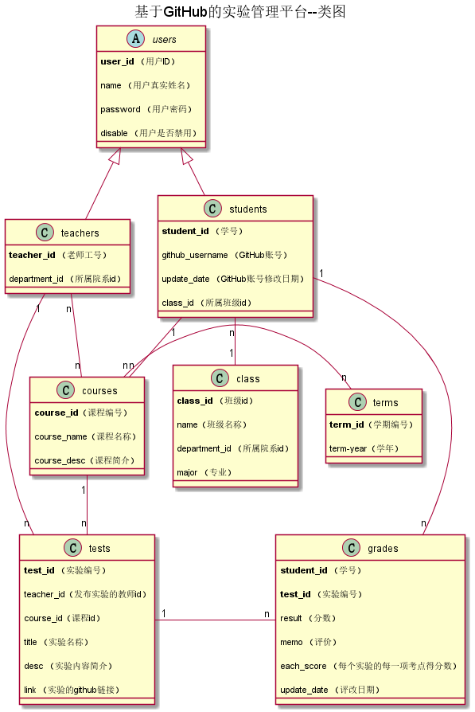

# 实验6：基于GitHub的实验管理平台的分析与设计
|学号|班级|姓名|照片|
|:-------:|:-------------: | :----------:|:---:|
|201510414317|软件(本)15-3|温兴与||

## 1. 概述
- 基于GitHub的实验管理平台的作用是在线管理实验成绩的Web应用系统。学生和老师的实验内容均存放在GitHUB
页面上。
- 学生的功能主要有：选择自己的课程，设置自己的GitHub用户名，查询自己的实验成绩。学生的GitHub用户名是公开的，但成绩不公开。
- 老师的功能主要有：发布实验，批改每个学生的成绩，查看每个学生的成绩。
- 管理员的功能主要有：录入院系、班级、课程信息，管理教师、学生信息，导入学生（教师）与课程的对应关系。
- 老师和学生都能通过本系统的链接方便地跳转到学生的每个GitHUB实验目录，以便批改实验或者查看实验情况。
- 实验成绩按数字分数计算，每项实验的满分为100分，最低为0分。
- 系统自动计算每个学生的所有实验的平均分。

## 2. 系统总体结构

[界面设计](https://zwdbox.github.io/is_analysis/test6/ui/index.html)

## 3. 用例图设计 [源码](./src/usecase.puml)

## 4. 类图设计 [源码](./src/class.puml)

## 5. 数据库设计
- ### [参见数据库设计](./数据库设计.md)

## 6. 用例及界面详细设计

- ### [“登录”用例](./用例/登录.md),
- ### [“登出”用例](./用例/登出.md),
- ### [“查看用户信息”用例](./用例/查看用户信息.md),
- ### [“修改用户信息”用例](./用例/修改用户信息.md),
- ### [“修改密码”用例](./用例/修改密码.md),
- ### [“发布实验”用例](./用例/发布实验.md),
- ### [“评定成绩”用例](./用例/评定成绩.md),
- ### [“学生选课”用例](./用例/学生选课.md),
- ### [“教师选课”用例](./用例/教师选课.md),
- ### [“学生列表”用例](./用例/学生列表.md),
- ### [“查看成绩”用例](./用例/查看成绩.md),
- ### [“选择班级”用例](用例/选择班级.md),

