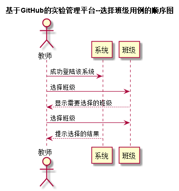

# “选择班级”用例 [返回](./README.md)
## 1. 用例规约
|用例名称|选择班级|
|-------|:-------------|
|功能|用户登录之后首先选择班级|
|参与者|学生，老师|
|前置条件|学生，老师需要先登录|
|后置条件| |
|主流事件| |
|备注| |

## 2. 业务流程（顺序图） [源码](../src/选择班级.puml)
 

## 3. 界面设计
- 界面参照:
- API接口调用
         - 接口1：[choooseClass](../接口/get.md) 

## 4. 算法描述（活动图）

## 5. 参照表
- [STUDENTS](../数据库设计.md/#STUDENTS)class
- [TEACHERS](../数据库设计.md/#TEACHERS)
- [Class](../数据库设计.md/#TERMS)

